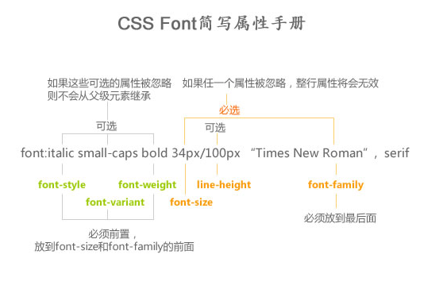

## 一句话tips
* 强制不换行: `white-space: nowrap`
* 空格大小 =  **宋体** 字体下字体大小的一半
* dd,dl{margin: 0}

## 之前印象笔记记过的html部分
* 只有body有bgcolor属性：<body bgcolor="#E6E6FA">
* 表格\<table\>  （表头用\<caption\>）

	```html
<table>
     <thead>
          <tr>
               <th><th>
               <th><th>
          </tr>
     </thead>
     <tbody>
          <tr>
               <td colspan="2"><td>
     </tbody>
</table>
```

	* \<table>里加border="1"才管用，在css里不行，只对父元素生效
	* table｛border-collapse：collapse｝
	* 要记得清空padding：th，td｛padding，0；｝

- 表单\<form>

```html
<fieldset>
     <legend>xxx</legend>
</fieldset>
```


- id定义的规则：

    - 下划线，字母开头（下划线不推荐，css2.0会限制使用）

    - 数字，空格，连字号
- XHTML（头部在sublime里敲html:xt，按tab自动生成）
    - id属性代替name属性
    - <xxx  />   注意应该追加一个空格
    - css中   a｛text-decoration：   none｝   也应该追加一个空格

## 之前印象笔记记过的css部分
- transition:1s    代表过渡动画持续1秒，常配合javascript使用
- 自定义列表标志

```css
ul{
  list-style:square inside url('/i/arrow.gif');}
//分开写
li{list-style-image:url();
   list-style-type:square /circle /upper-roman /lower-alpha;
   list-style-position:inside/outside/inherit;}
```

- css文字：
    - font（复合时有顺序：font-weight font-style font-size必须写 / line-height  font-family必须写）
        - font-family:"宋体"
        - font-size：
        - font- weight（100~900）：lighter/bold/bolder(700)/normal(400)
        - font-style:italic/normal/oblique(文本倾斜显示)
        - font-variant:small-caps(例如：THIS IS A BOOK)
    
    - direction（设置文本方向）：rtl/ltr
    - text-align:(left)/center/right，竖直方向用line-height调节
    - text-indent:首行缩进(可继承)，支持块元素，行内元素靠padding/margin实现
    - text-decoration:underline/line-through/overline/none/blink
    - text-transform:none/uppercase/lowercase/capitalize
    - letter-spacing(一般来说字的右边有1px的留白)
    - word-spacing

    - 块级元素居中用左右外边距实现


- 单元格内加入图片时图片下方自带一层白条，所以想要把图片居中只能vertical-align:top;

- display：inline/block/inline-block
    - inline:
        - 内容撑开宽度
        - 不支持上下margin
        - 代码里的换行会被解析为空格分割
    - block：
        - 默认独占一行
        - 没有宽度默认撑开一排
        - 支持宽高
    - inline-block：
        - 块在一行显示
        - 行内属性支持宽高
        - 没有定义宽度是内容撑开宽度
- a:link/visited/hover/active
- 清除浮动的方式
   - br可以清浮动：<br  clear = "all"/>
   - after伪类清浮动：


```
<div class="clear">
     <div style="float:left">....</div>
     <div style="float:right">...</div>
</div>

.clear｛zoom：1；｝
.clear：after｛content:""；display：block；clear：both；｝
```

-  元素透明
    - ｛opacity：0.50~1｝ 。。。。。会连带里边的子元素变透明
    - IE6，7下，｛filter：alpha（opacity=500~100）；｝


- 通用字体系列   ｛font-family：A字体，B字体，C字体；｝
    - Serif：字母带脚，尖尖头
    - sans-serif：不带脚，秃的
    - monospace：老式打字机字体
    - cursive：手写花体
    - fantasy：其他字体
    - Arial≈Helvatica
- css3里，background-size：xxx，指定背景放缩

- 各种对齐：

    - 表格内文本对齐：text-align/vertical-align
    - border-collapse:separate/collapse
    - empty-cells:hide

    - 水平对齐块级元素

        - 将左右margin设置成auto--->均等分配可用外边距
        - `position：absolute；right：0px；left：50%；margin-left：一半宽度`

- 选择器：

    - 后代选择器：p  strong

    - 子选择器：p >  strong

- 导航栏

    - 水平导航栏：
        - li｛float：left；｝     a｛display：block（使链接整个区域内可点击）；width：60px；｝

    - 垂直导航栏：
        - a｛display： block（使链接整个区域内可点击）；width：60px；｝


- 自适应按钮（三层嵌套背景实现）

    - 多层嵌套时，越往里的元素background背景越在上边

```css
#nav li{float: left;height: 28px; }
#nav a{float:left;height:28px;font-size: 16px;color: #ffffff;background: url(../images/nav-btn.png) repeat-x 0 -28px;}
#nav strong{float:left;height:28px;background: url(../images/nav-btn.png) no-repeat right 0;}
#nav span{float:left;height:28px;background: url(../images/nav-btn.png) no-repeat 0 -56px ;padding: 0 16px;}
```


## 关于字体的复合样式
 > 必填项有: **font-size**和**font-family**,例如:`style="font: 20px '微软雅黑';"`
 ----
 > 注: mac上的chrome如果要使用微软雅黑的话,要写成: `font-family: 'Microsoft Yahei'`
 
  
 
 
## 关于背景background的复合样式
*background复合样式写法是没有顺序要求的
			但是，建议人为分类。
			颜色 -> 图片 -> 重复 -> 位置(/大小 裁剪 基点) -> 滚动*
			
```css
background: [background-color] [background-image] [background-repeat]
            [background-attachment] [background-position] / [ background-size]
            [background-origin] [background-clip];
```
实例:

```css
.example {
  background: aquamarine url(img.png)
              no-repeat
              scroll
              center center / 50%
              content-box content-box;
}
```

## 几种图片格式

| 格式 | 用途 |支持透明 | 支持半透明（渐变阴影） |
|:-:|:-:|:-:|:-:|
| gif/png-8  |    小图标  | 是   |否    |
| jpeg |大图海报|否|否|
| png-24|还原度最好|是|是